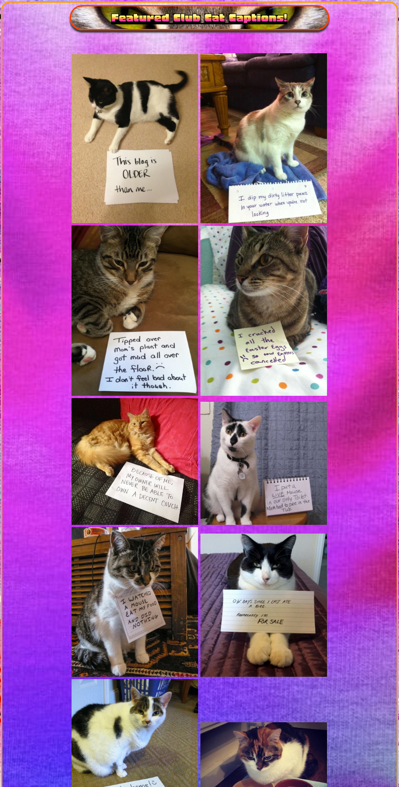
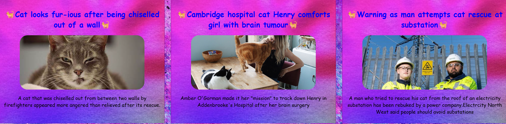
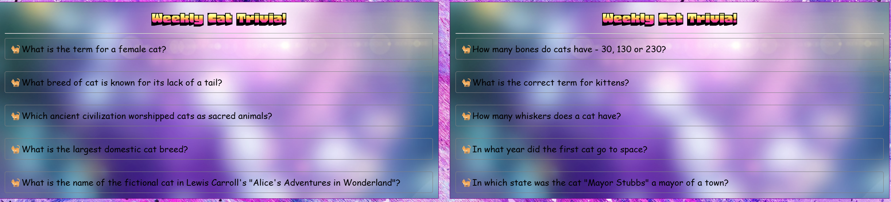
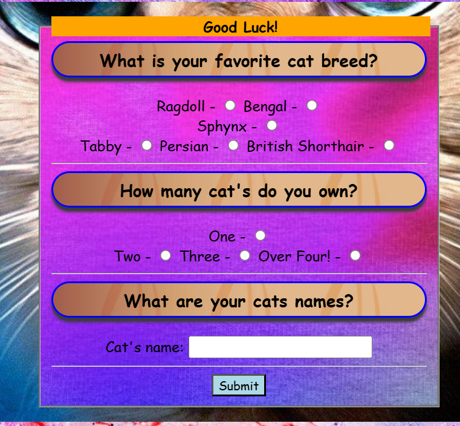

# Cat Lover's Retreat Website by Max Wiseman

### Welcome to the Cat Lover's Retreat Website! 🐾

#### Here is the GitHub Pages link to *[Cat Lover's Retreat](https://maxbwiseman.github.io/CatFanWebsite--MaxW/)*.

# Deployment

This section should describe the process you went through to deploy the project to a hosting platform (e.g. GitHub)

The site was deployed to GitHub pages. Which is shown above. The steps to deploy are as follows:
In the GitHub repository, navigate to the Settings tab
From the source section drop-down menu, select the Master Branch
Once the master branch has been selected, the page will be automatically refreshed with a detailed ribbon display to indicate the successful deployment.

# About
This website is dedicated to cat enthusiasts who share our love for furry companions. This website was created with HTML and CSS, and a special thanks to Code Institute for providing me with the guidance to create this project. So, whether you’re a seasoned cat owner or simply adore feline friends, this platform is for you. Here’s what you’ll find:

# Features

## Meetups
### Stay informed about cat-related gatherings! Our meetup page provides details on upcoming events, locations, and times.

## Competitions
### Get ready for some feline fun! Explore ongoing cat-themed competitions with exciting prizes up for grabs.

## Cat Gallery
### Enjoy a delightful collection of cat pictures. Each image comes with a humorous caption, showcasing our feline friends in various adorable scenarios.

## Cat News Hub
### Stay updated on the latest cat-related news. From heartwarming stories to scientific discoveries, we’ve got it covered.

## Join the Community
### Share your passion! Sign up with your email address to receive updates, exclusive content, and invitations to special events.

## Quick Tips
### Need cat advice? Click on our interactive icons for handy tips and facts about cat care, behavior, and more.

## Weekly Cat Quiz
### Test your cat knowledge! Take our fun and brief weekly quiz to challenge yourself and learn something new.

## Competition Application
### Ready to participate? Head over to our competition application page and submit your entry.

### Let’s celebrate our whiskered companions together! 🐱

# Lighthouse

### This website was tested for responsiveness using microsoft lighthouse

## For PC

## For Mobile

# Mobile support

### The Cat Lover's Retreat should be viewable on most phones, tablets/pads will not work very well and support for them is a possible feature in the future. Here are some screenshots taken with a Iphone SE phoneview - 

# Known Bugs
### There is a bug with responsive design on tablet view at the bottom of the index.html page. 

# Possible new features

### 1. A feature like a chat room for members , so people can freely talk about cat related things together.
### 2. A working Cat Caption submit button, so people can freely submit cat photos

# HTML/CSS Tests

## Thanks for taking time to check out my first ever website! 🐾

#### Here is the GitHub Pages link to *[Cat Lover's Retreat](https://maxbwiseman.github.io/CatFanWebsite--MaxW/)*.

