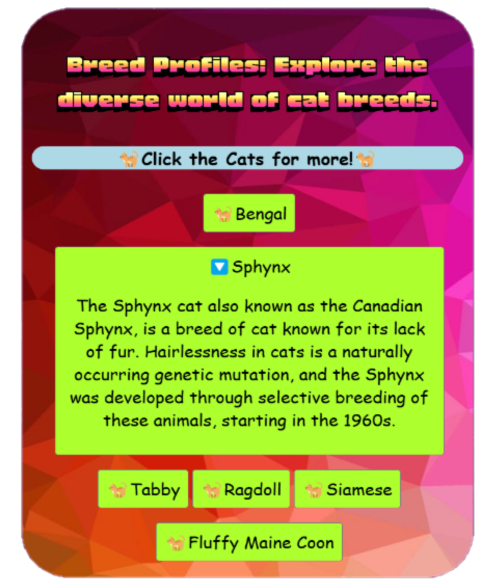
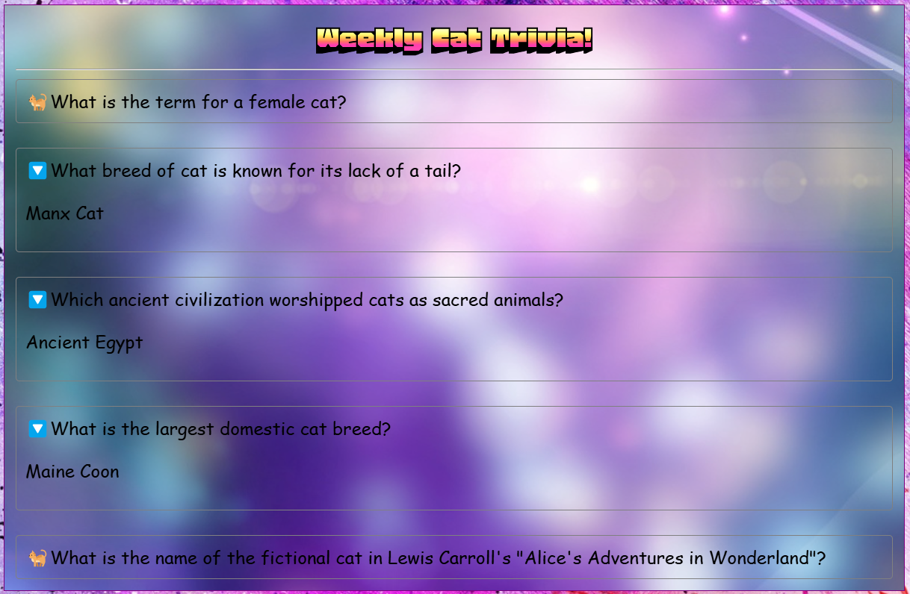
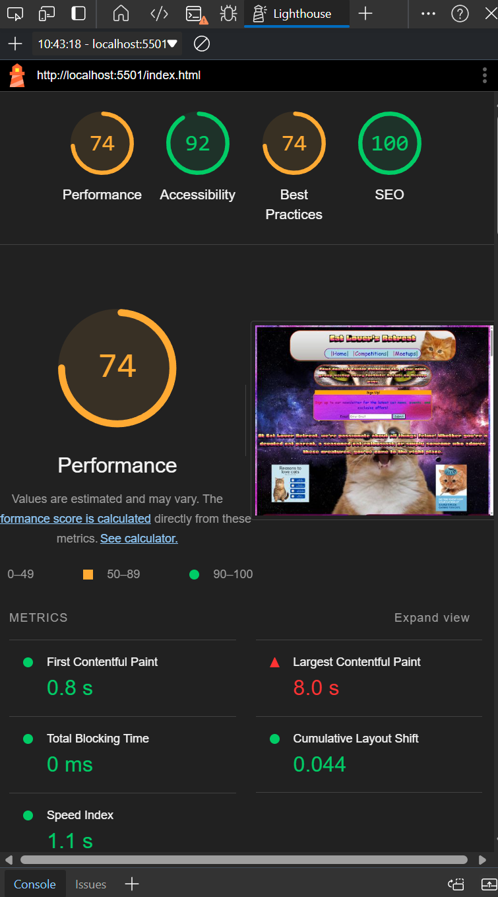

# Cat Lover's Retreat Website by Max Wiseman

    <!--     You can add your logo in the _src_ below -->
    

### Welcome to the Cat Lover's Retreat Website! 🐾

#### Here is the GitHub Pages link to *[Cat Lover's Retreat](https://maxbwiseman.github.io/CatFanWebsite--MaxW/)*.

# About
This website was my first ever website, using no bootstrap or any other pre made assets, its dedicated to cat enthusiasts who share our love for furry companions. This website was created with HTML and CSS, and a special thanks to Code Institute for providing me with the guidance to create this project. So, whether you’re a seasoned cat owner or simply adore feline friends, this platform is for you. Here’s what you’ll find:

# Features

### **Meetups**
### Stay informed about cat-related gatherings! Our meetup page provides details on upcoming events, locations, and times.

### **Competitions**
### Get ready for some feline fun! Explore ongoing cat-themed competitions with exciting prizes up for grabs.

### **Cat Gallery**
### Enjoy a delightful collection of cat pictures. Each image comes with a humorous caption, showcasing our feline friends in various adorable scenarios.

### **Cat News Hub**
### Stay updated on the latest cat-related news. From heartwarming stories to scientific discoveries, we’ve got it covered.

### **Join the Community**
### Share your passion! Sign up with your email address to receive updates, exclusive content, and invitations to special events.

### **Quick Tips**
### Need cat advice? Click on our interactive icons for handy tips and facts about cat care, behavior, and more.

### **Weekly Cat Quiz**
### Test your cat knowledge! Take our fun and brief weekly quiz to challenge yourself and learn something new.

### **Competition Application**
### Ready to participate? Head over to our competition application page and submit your entry.

### Let’s celebrate our whiskered companions together! 🐱

# Testing

### **Testing on this project was mainly done manually by myself**

## Testing game
| Test |Outcome  |
|--|--|
|Navigation | Pass |
|Page links (e.g news links)| Pass|
|No image errors| Pass|
|Form submits| Pass|
|Footer links | Pass|
|Form error if not all fields are entered before send |Pass|
|No lorem ipsum |Pass|

## Testing for responsiveness
| Test |Outcome  |
|--|--|
|Home page displays correctly on screens larger than 950px|Pass |
|Home page displays correctly on screens smaller than 950px |Pass |

## User testing

### **I let my Mum use the website and found that -**

| Test | Result |
|--|--|
|Upon arrival the facts area was used and clicked on| 100%|
|The quiz was played |100%  |
|Navigation between all pages| 100%|
|A positive reaction from the funny cat captions| 100%|
|Google maps API was looked at| 100%|

# Lighthouse

### **This website was tested for responsiveness using microsoft lighthouse**

### **For PC**

### **For Mobile**

# Responsiveness

### The Cat Lover's Retreat should be viewable on most phones, tablet support is now availible too! Here are some screenshots taken with a Iphone SE phoneview - 

# HTML/CSS Tests

# Possible new features

### 1. A feature like a chat room for members , so people can freely talk about cat related things together.
### 2. A working Cat Caption submit button, so people can freely submit cat photos

## Deployment

- This site was deployed to GitHub Pages

- In the repository navigate to the Deployments section on the righthand side under the "About" section - https://github.com/MaxBWiseman/CatFanWebsite--MaxW/deployments

- Select the link at the top of the deployments list

- Enjoy your time at Cat Lovers Retreat!

Or click this link! = https://maxbwiseman.github.io/CatFanWebsite--MaxW//

### If you wish to download as a zip file

- Navigate to the Code dropdown near the about section for the project

- Download Zip at the bottom of the drop down

- Find the download location and extract all from the zip file

- Open a editor like VS code

- Press Explorer and select "Open File"

- Navigate to the download location of the extracted zip file

- Click into the folder until the title is not showing as a file

- Open Folder in the bottom right

- Either use the "Live Server" Extension  by Ritwick Dey to easily start a server on the bottom right of the editor with "Go Live" button (Extension must be installed)

- Or boot a local server with python aslong as its installed on your machine  with - "python3 -m http.server" inside the terminal (ctrl-j)

### Github Fork

- You may fork the repository into your own repo with the "Fork" button on this projects github page at the top right next to "Starred"

- Navigate to your repositorys and click on your fork of this project

- Navigate on the top bar to "Settings"

- Then to "Pages"

- Deploy from the latest branch (or an older one if desire)

- Press "Save", your pages link should show on the "Pages" tab in 3 minutes or less

# Known Bugs
### 1. There is a bug with responsive design on tablet view at the bottom of the index.html page. 

### 2. Update on responsive design bug, removed map for tablet view and hid mobile only footer, centering still needed.

### 3. Temporary fix with centering with 'margin-left:75px;'

### 4. Githubs version of markdown does not support the <u></u> tags, changed to '**' asterisk bold in my readme file.

### 5. There is a strange bug with responsive design were sometimes using developer tools on my website to check responsivness, it doesnt work and requires to select a phone screen (e.g Samsung Galaxy S8+) and then responsiveness kicks in again. Not sure what causes this hiccup. Here is a video posted to youtube as the file size was too big for github, to explain the strange issue - 

[Bug Video, will direct to YouTube](https://youtube.com/shorts/uA5qZLmV-Kg?feature=share)

# Credits

### - Credits to google images (not including my own picutures of my own cats)

### - Cat Captions from: https://www.catshaming.co.uk/

### - Thanks to w3schools for css advice on positioning images side by side: https://www.w3schools.com/howto/howto_css_images_side_by_side.asp

### - Thanks to bing search engine for showing me how to get multicolored text: https://www.bing.com/search?pglt=41&q=how+to+get+text+to+flash+different+colors+html+css&cvid=db48e436c54c4c8e9c163fea72130182&gs_lcrp=EgZjaHJvbWUyBggAEEUYOdIBCDgwODZqMGoxqAIIsAIB&FORM=ANNTA1&PC=LCTS&showconv=1*/ 

### - Thanks to free web headers for images and banners: https://www.freewebheaders.com/animals/cats-headers/

### - Credit to BBC News for there funny articles on cats: https://www.bbc.com/news

## Thanks for taking time to check out my first ever website! 🐾

#### Here is the GitHub Pages link to *[Cat Lover's Retreat](https://maxbwiseman.github.io/CatFanWebsite--MaxW/)*.

