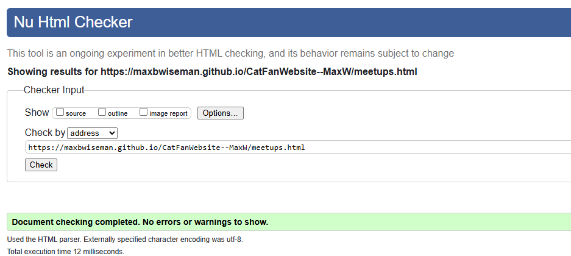

# Cat Lover's Retreat Website by Max Wiseman

    <!--     You can add your logo in the _src_ below -->
    

### Welcome to the Cat Lover's Retreat Website! 🐾

#### Here is the GitHub Pages link to *[Cat Lover's Retreat](https://maxbwiseman.github.io/CatFanWebsite--MaxW/)*.

# Deployment

- This site was deployed to GitHub Pages

- In the repository navigate to the setting tab

- From the source section drop down menu select the master branch

- Once the master branch has been selected, the page provided the link to the completed website

= https://maxbwiseman.github.io/CatFanWebsite--MaxW/

Or click the link above!

# About
This website was my first ever website, using no bootstrap or any other pre made assets, its dedicated to cat enthusiasts who share our love for furry companions. This website was created with HTML and CSS, and a special thanks to Code Institute for providing me with the guidance to create this project. So, whether you’re a seasoned cat owner or simply adore feline friends, this platform is for you. Here’s what you’ll find:

# Features

### <u>Meetups</u>
### Stay informed about cat-related gatherings! Our meetup page provides details on upcoming events, locations, and times.

### <u>Competitions</u>
### Get ready for some feline fun! Explore ongoing cat-themed competitions with exciting prizes up for grabs.

### <u>Cat Gallery</u>
### Enjoy a delightful collection of cat pictures. Each image comes with a humorous caption, showcasing our feline friends in various adorable scenarios.

### <u>Cat News Hub</u>
### Stay updated on the latest cat-related news. From heartwarming stories to scientific discoveries, we’ve got it covered.

### <u>Join the Community</u>
### Share your passion! Sign up with your email address to receive updates, exclusive content, and invitations to special events.

### <u>Quick Tips</u>
### Need cat advice? Click on our interactive icons for handy tips and facts about cat care, behavior, and more.

### <u>Weekly Cat Quiz</u>
### Test your cat knowledge! Take our fun and brief weekly quiz to challenge yourself and learn something new.

### <u>Competition Application</u>
### Ready to participate? Head over to our competition application page and submit your entry.

### Let’s celebrate our whiskered companions together! 🐱

# Lighthouse

### This website was tested for responsiveness using microsoft lighthouse

### <u>For PC</u>

### <u>For Mobile</u>

# Responsiveness

### The Cat Lover's Retreat should be viewable on most phones, tablets/pads will not work very well and support for them is a possible feature in the future. Here are some screenshots taken with a Iphone SE phoneview - 

# Known Bugs
### There is a bug with responsive design on tablet view at the bottom of the index.html page. 

### Update on responsive design bug, removed map for tablet view and hid mobile only footer, centering still needed
)

# Possible new features

### 1. A feature like a chat room for members , so people can freely talk about cat related things together.
### 2. A working Cat Caption submit button, so people can freely submit cat photos

# HTML/CSS Tests

# Credits

### - Credits to google images for the pictures (not including my own picutures of my own cats)

### - Thanks to w3schools for css advice: https://www.w3schools.com/howto/howto_css_images_side_by_side.asp

### - Thanks to bing search engine for showing me how to get multicolored text: https://www.bing.com/search?pglt=41&q=how+to+get+text+to+flash+different+colors+html+css&cvid=db48e436c54c4c8e9c163fea72130182&gs_lcrp=EgZjaHJvbWUyBggAEEUYOdIBCDgwODZqMGoxqAIIsAIB&FORM=ANNTA1&PC=LCTS&showconv=1*/ 

### - Thanks to free web headers for images: https://www.freewebheaders.com/animals/cats-headers/

## Thanks for taking time to check out my first ever website! 🐾

#### Here is the GitHub Pages link to *[Cat Lover's Retreat](https://maxbwiseman.github.io/CatFanWebsite--MaxW/)*.

